# Demos

Effects for a FlaschenTaschen display. The Python ones here are numpy demos
that push whole frames; the C++ ones live in [`src/`](src/) and are built with
`make`.

```console
$ python3 fire.py --host 127.0.0.1
$ python3 tunnel.py --texture checker --palette magma
$ python3 metaballs.py --balls 8 --palette toxic --contour 6
```

Every demo takes `--host`, `--port`, `--width`, `--height`, `--layer`,
`--band`, `--fps` and `--duration`; `--duration` auto-stops, so a launched
stream can never become a runaway flooder. `--help` lists the rest, and most
take `--palette`.

Requirements: numpy, plus Pillow for `scroller.py`, and the `flaschen` client
from [`../api/python`](../api/python) (`pip install ./api/python`, or just run
from a clone — the demos fall back to the checkout).

No display to hand? [`../tools/ft-emulator`](../tools/ft-emulator) is a server that
renders to a browser instead of hardware, which is how the screenshots below
were taken.

## megademo


Plays the effects back to back as one continuous show, with real transitions
instead of hard cuts, and a scrolling banner over the bottom. Both effects are
live during a transition and their frames are blended; the type is chosen per
boundary, because a sparse effect crossfaded under a busy one is invisible and
wants a fade through black instead.

Effects are built on a worker thread a couple of segments ahead. Building
everything up front means a slow black start and every table resident at once;
building at the transition stalls visibly, since `scroller` bakes for seconds.

```console
$ python3 megademo.py --playlist "fire:20,tunnel:15:wipe,water:12+drops=4"
$ python3 megademo.py --no-banner --segment 25 --transition 3
```

## The effects

### fire

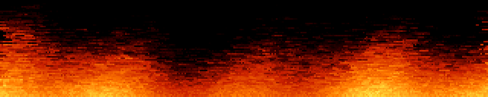

Doom-style fire: a row of burning fuel along the bottom, and every frame each
cell takes the heat of the cell below it, shifted sideways at random and
cooled a little. The randomness is what turns a smooth gradient into flames.
Done as one vectorized step over the whole buffer.

```console
$ python3 fire.py --palette ice --wind -0.4 --cool 4
```

### tunnel


For every pixel, the angle around the centre and a depth that grows as you
approach it, used as texture coordinates. Scrolling the depth flies you
forward; scrolling the angle rolls the tunnel. Both depend only on the pixel,
so they are computed once and each frame is two integer adds, a mask and a
gather.

```console
$ python3 tunnel.py --texture rings --speed 120 --roll -0.3
```

### starfield


Stars drift towards the camera and are divided by their depth, so one crawls
while it is far away and then sweeps past. Each is drawn several times along
the distance it covered during the frame, which is what makes the streaks.

```console
$ python3 starfield.py --stars 800 --speed 1.6 --warp 6 --tint ice
```

### metaballs


Each ball contributes a field that falls off with distance; the fields are
summed and coloured through a palette. Because the sum is smooth, two balls
approaching each other bulge and merge into one shape rather than overlapping
— which is the point, and something you cannot get by drawing circles.

```console
$ python3 metaballs.py --balls 8 --palette toxic --contour 6
```

### rotozoom


Rotate and scale a tiled texture by working backwards: for each pixel on
screen, apply the inverse transform to find where it lands in the texture.
Every pixel then gets exactly one sample with no gaps to fill, which is why
the effect was cheap enough for hardware that could not multiply quickly.

```console
$ python3 rotozoom.py --texture xor --spin 0.35 --zoom-min 0.4
```

### laser


A laser cutter working through a job: a searing head tracing a vector path,
the kerf cooling behind it, and the piece dropping out when the outline
closes.

One scalar heat field carries all of it — the head writes 1.0 along the arc it
covered this frame, the field decays, and a black→red→orange→white ramp turns
it into kerf, trail and head bloom together. Cooling is a half-life in
*seconds* rather than a per-frame factor, so the trail is the same length in
wall time whether the demo runs at 8 fps or 30.

Paths are generated — gears, finger-jointed panels, filigree, slot lettering —
cut holes first, outline last, with dark rapid moves between contours and the
head stepping in arc length so corners do not speed up.

Heat alone cannot tell what belongs to the part, since lettering cut ten
seconds ago has already decayed out of the ramp, so a per-job cut mask relights
the whole piece for the second it takes to fall.

```console
$ python3 laser.py --cool 2.0 --shapes gear,filigree
```

### printer


A 3D printer seen side-on: gantry climbing a row per layer, nozzle glowing,
part rising with visible infill — and sometimes failing into spaghetti.

Silhouettes are functions of normalised coordinates rather than sprites, so
they rasterise to whatever height the panel gives. Each layer is classified
into perimeter, skin and infill, and only the infill stencil is drawn, which is
why the cross-section is a lattice rather than a filled outline.

Failure is two independent draws per print — whether, and then independently
where, anywhere from 8% to 94% of the way up. Over 148 prints that gave 29.7%
failures spread evenly across the height; an early failure leaves nothing but
nest, a late one leaves a near-complete part with strands draped over it.

The spaghetti took three attempts. The coil phase has to come off one clock
shared by the whole strand: sampled per point it is confetti, and tied to
emission rate it is a smooth rope. Only the shared clock gives loose curling
filament.

```console
$ python3 printer.py --fail-rate 0.15 --speed 1.4
```

### knit

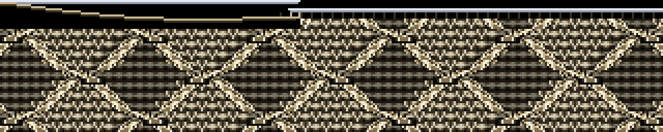

An Aran cable sweater worked stitch by stitch. A knitting chart is already a
pixel grid — colourwork and cable charts are low-resolution raster art — so
stitches are 5x5 sprites blitted from source data, never drawn as curves.

What sells it is that the work is visibly *happening*: the row advances a
stitch at a time with jitter and hesitations, needles meet at the live stitch
with loops hanging from them, and rows alternate direction the way hand
knitting actually does. Cable crossings animate as the cable-needle move — the
front pair lifts clear leaving a shadowed hole, the other pair slides through,
the held pair drops into the vacated columns.

The chart is generated: counting cable ropes to the left of a stitch identifies
its rhombus, and the parity of that count is a checkerboard over the lattice,
which is what alternates seed-filled diamonds with reverse stockinette.

```console
$ python3 knit.py --diamond 14 --stitch-rate 9
```

### wheel

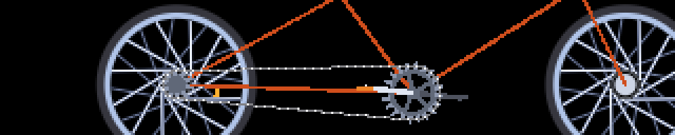

A bicycle drivetrain: three-cross laced wheel, chainring and cranks, chain
tracking both sprockets. Gear ratio is derived rather than tuned — both
sprockets share a chain pitch, so pitch radii follow from tooth counts and the
ratio falls out.

All spokes of a flange are tangent to one circle about the hub, so the tangent
angle for a pixel at `(r, a)` is `a ∓ arccos(d/r)`. That is baked once; a frame
reduces it modulo the spoke spacing, with no loop over spokes.

The moiré is the point, not an artifact. Thin spokes crossing a discrete pixel
grid genuinely strobe, and `--sweep` walks the rotation rate through the speeds
where the pattern stalls, crawls and reverses. The rim reflector cannot alias,
so it keeps sweeping while the spokes stand still — which is what makes the
illusion read as an illusion rather than a paused demo.

```console
$ python3 wheel.py --speed 5.0 --sweep 0 --spokes 32
```

### sunset


Driving west into a San Francisco sunset: sliced sun low over the Pacific,
glitter on the water, road running to the vanishing point, Sutro Tower on a
headland, Karl rolling in.

The sun is sliced with horizontal gaps that widen downward — the retro
treatment, and also the right call for a panel that bands in the dark end,
since deliberate horizontal structure reads as intentional where accidental
contouring does not.

Two things that only showed up by looking: distance haze on a gentle ramp
smeared the sky's reflection over the whole plane and the ocean read as wet
tarmac, fixed by confining it to a hard band a few rows deep at the horizon;
and a depth-scrolled water texture cannot win at this size — tight enough for
foreground crests, it aliases to hash across the mid field — so the swell is
one sine of each row's depth instead.

```console
$ python3 sunset.py --sun 0.8 --fog 0.4 --no-tower
```

### grove

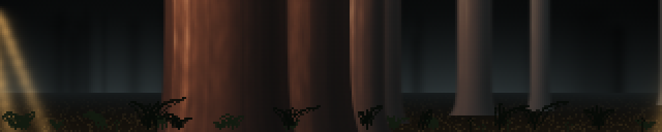

Drifting through a sequoia grove: trunks running off the top of the frame,
warm shafts angling between them, fog in the gaps. You see a slice, not whole
trees, which is what standing in a grove actually looks like.

Bark is sampled at `arcsin(x/half)` — the true angle around the cylinder — so
fibres crowd toward the silhouette and the trunk reads as round rather than as
a flat bar. Depths are spaced geometrically, because linear spacing puts
everything in the middle distance where the parallax rates are indistinguishable.

Shafts carry a depth too, so occlusion is free: a nearer trunk blitted
afterwards interrupts the beam, and that interruption is what makes the light
feel three-dimensional. Nothing is blurred at run time — softness is baked into
the sprites.

```console
$ python3 grove.py --speed 6 --shafts 3 --fog 1.4
```

### goldengate

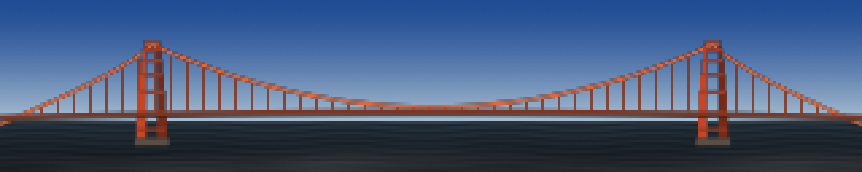

The bridge standing out of the fog. Geometry comes from the real thing in feet
— 4200 ft main span, 526 ft of tower over a 220 ft deck — at one pixels-per-foot
scale that happens to serve both axes of a 320x64 panel.

The detail that stops it reading as a generic suspension bridge is that the
main cable's vertex sits *on* the deck at midspan. Stepped Art Deco setbacks,
portal braces whose openings shorten going up, and single-pixel suspenders
every 6 px do the rest.

Fog is two tileable noise tiles scrolled across each other, windowed by a
rolling edge and a travelling bank envelope, with density tied to bank height
so a high bank is a thick one. The level clamps at both ends rather than
wandering mid-range — otherwise you get permanent haze instead of weather, and
never the frame where only the tower tops show.

```console
$ python3 goldengate.py --time-of-day 6 --day-cycle 0 --fog 0.8
```

### karl

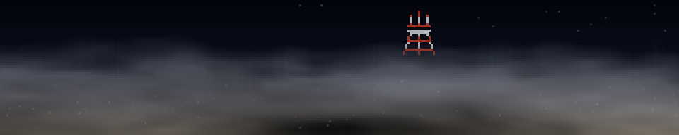

Karl the Fog over the Twin Peaks ridgeline, swallowing Sutro Tower and letting
it go again. The calmest thing here — a full cycle from clear to buried takes
minutes.

Two noise textures scrolled at different rates and weighted differently by row,
with the detail layer's sample position displaced by the coarse layer. That
domain warping is what makes it curl rather than slide, and it costs a gather
rather than a simulation.

Density comes off the clock as three sines at incommensurate periods, saturated
at the ends so it *dwells* buried and then dwells clear instead of passing
through both.

Worth knowing if you touch the compositing: on this hardware, broadcasting an
`(H,W,1)` against an `(H,W,3)` is about four times slower than doing the same
arithmetic three times on contiguous planes.

```console
$ python3 karl.py --density 1.3 --speed 0.6 --no-tower
```

### slime


A Physarum transport network. Sixteen thousand agents each sense the trail
ahead of them at three angles, turn toward the strongest, move, and deposit;
the trail map is blurred and decayed each step. Nothing draws the network — the
filaments, junctions and loops are what those rules settle into.

Three departures from the textbook rule, each fixing a specific failure:

*Capping* the trail map stops it being winner-take-all. Uncapped, the busiest
strand reads brightest, out-attracts its neighbours, and within a minute two
fat strands hold the entire population.

*Food* — weak, slowly drifting attractant sources — is the one that matters
most. Even capped and well tuned, the network **relaxes**: strands merge, bends
straighten, and after a few minutes all that is left is motionless vertical
lines, which are the shortest closed paths a wrapping 64-row canvas admits. No
decay value fixes that; it is the end state of the tuning rather than a failure
of it. Foraging forces junctions that relaxation cannot remove, and moving
sources keep it re-solving.

*Spore batches* nucleate new colonies that grow and fuse while starved branches
prune. They have to be a batch in one place and facing outward — scattered
agents just join the nearest strand, and random headings give a trapped orbit
that shows as permanent confetti.

`--deposit` is expressed as the resulting equilibrium mean trail value, with
the per-agent amount derived from it, so changing agent count or decay does not
move the brightness — only the sharpness of pruning. Decay 0.94 is about
sixteen steps of memory; 0.98 floods to a uniform lit field in twenty seconds
and 0.85 never organises at all.

The trail is seeded with blurred noise and given a few hundred warmup steps
inside `build()`, so frame zero is already a network rather than something you
wait for.

```console
$ python3 slime.py --agents 24000 --sensor-dist 5 --palette ice
```

### fireflies

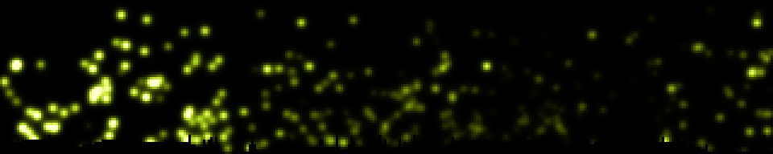

A field of oscillators that spontaneously synchronise. Each firefly has its own
natural rate and flashes when its phase wraps; coupling pulls it toward its
neighbours, and out of that come waves of synchrony that sweep across the panel
and collide.

Coupling is deliberately **local**, not mean-field. Mean-field is cheaper, but
the whole field then snaps into unison at once, which is far duller to watch —
local coupling is what produces travelling waves, and a 5:1 panel is the right
shape to see them cross. Each phase is splatted as a unit vector into a coarse
grid, the grid is blurred, and the result sampled back at each position: O(N)
plus a small blur, with the blur radius acting as the coupling range.
Normalising by the blurred *count* makes the pull depend on how much a
neighbourhood agrees rather than how crowded it is, so a synchronised patch
recruits its border.

Two things keep it from going static, which is the real design problem — a
fully locked field is as boring as a scattered one. The frequency spread is
wide enough that full lock is unreachable, and the natural frequencies
themselves drift, so there is no fixed consensus to converge on: leaders change
and every truce eventually breaks. Measured over five minutes the global order
parameter roams 0.08 to 0.84 indefinitely, reaching 0.8 within twenty seconds
from a cold start, so a short slot still shows the arc. With `--coupling 0` it
sits at 0.05 and never organises, which is the control worth keeping in mind.

```console
$ python3 fireflies.py --coupling 2.5 --range 40 --no-grass
```

### mario

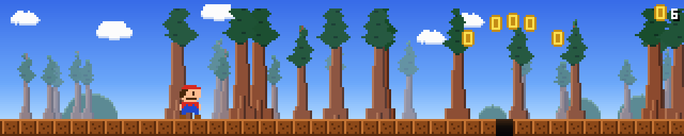

A self-playing side-scrolling platformer: a little plumber runs right through
an endlessly generated level, jumping pipes and gaps, collecting coins and
stomping the odd goomba, over three layers of parallax.

The background is a sequoia grove rather than the round two-lobed bushes the
genre expects — cinnamon trunks bare for two thirds of their height, the
nearest of them running off the top of the panel. They are the only scenery at
the character's own scale, so they are what the scene reads as; the level in
front of them stays eight-bit. Trees are stamped into one wide strip at two
depths, the far ones shorter and blended toward the sky, and the strip is
scrolled by slicing, so the whole grove costs one wrapped blit a frame.

Uses 8 px tiles with a two-tile character rather than classic 16 px ones. At
16 the panel is four tiles: ground plus character leaves under a tile of
headroom and there is no jump arc at all. At 8 it is eight tiles — one ground,
two character, five of air — which is what makes a three-tile pipe clearable.
`--scale 2` gives real 16 px tiles and demonstrates the problem: no pipe
height passes the clearance test, so the generator emits only gaps.

The level generator is bounded by the physics rather than tuned by hand.
`build()` derives the airtime and horizontal reach of a jump, then admits an
obstacle only if the actual trajectory clears it at *both* edges of its span —
the apex is over the middle, so the edges are the tight part — and leaves more
than one jump's reach of flat ground between obstacles. That is what stops it
ever generating something unclearable, which on an unattended wall would strand
the character hours later.

```console
$ python3 mario.py --density 0.6 --speed 70 --run-fps 14
```

### nyancat


The pop-tart cat, trailing a rainbow through twinkling stars. The sprite lives
in the source as rows of characters with a palette per character, so it can be
edited in a diff rather than shipped as an image; moving parts (four tail
poses, the paws) are separate grids composed into the six loop frames at
startup and scaled with `np.repeat`.

The sprite animates on its own clock (`--cat-fps`, default 10) rather than the
display rate — the original is much slower than a display refresh, and tying
the two together makes it look wrong at any frame rate but one. The trail is
baked a whole square-wave period wider than the panel, so scrolling it is a
slice at an offset.

A 320x64 panel is close to the ideal shape for this: the cat sits right of
centre and the rainbow reaches the far edge.

```console
$ python3 nyancat.py --cat-x 0.4 --speed 40 --no-stars
```

### floor

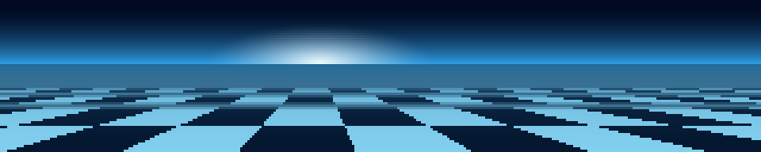

A Mode-7 perspective plane: gradient sky with a sun, a horizon, and textured
ground receding to it, with forward motion and a slow steer. Each screen row
below the horizon is at a constant distance, so per-row depth, texture step,
mip level and fog are all precomputed and a frame costs an add, a truncate and
one gather. An anisotropic mip chain kills the fish-scale moire that otherwise
covers the mid field, since a row near the horizon spans hundreds of texels of
depth while stepping a fraction of one across.

```console
$ python3 floor.py --texture road --palette magma --speed 90
```

### cycle


Colour-cycled plasma. The image is computed exactly once and the animation is
entirely the palette rotating under it — the classic technique, and about ten
times cheaper per frame than anything else here at 0.05 ms. The palette must
be *cyclic* or every wrap shows as a seam sweeping across the panel, so the
non-cyclic ramps are mirrored to close the loop.

```console
$ python3 cycle.py --pattern spiral --palette rainbow --bands 3
```

### water


A damped wave equation with drops falling on it, rendered by refraction rather
than by colouring height: the local slope offsets a lookup into a background,
so the surface bends what is beneath it. Uses a nine-point isotropic Laplacian
— the usual four-neighbour stencil makes ripples spread as diamonds and sits
right on the stability limit. Boundaries are fixed rather than wrapping, so
ripples reflect instead of reappearing on the far edge.

```console
$ python3 water.py --background grid --drops 5 --refract 34
```

### fireworks


Shells launch, arc up and burst into sparks that fall and fade. One fixed-size
particle pool in flat arrays, updated with whole-array operations and recycled
through dead slots, so every frame costs the same. Trails come from a decay
buffer. Spark speed is the load-bearing parameter: below about a pixel per
frame the sparks creep and the decay buffer paints a solid disc instead of
rays, so speed and drag have to be raised together.

```console
$ python3 fireworks.py --rate 3 --types willow,crackle --palette ice
```

### boing


The Amiga Boing Ball: a red and white checkered sphere spinning about a tilted
axis, bouncing in a purple wireframe room. The silhouette and the surface
coordinates of every pixel are precomputed once, so a frame is an add, an xor
and a masked blit. Checker counts derive from the radius and are forced even,
so the equator lands on a cell boundary and the pattern stays consistent
across the longitude wrap.

```console
$ python3 boing.py --radius 24 --segments 16 --bands 8
```

### daliclock

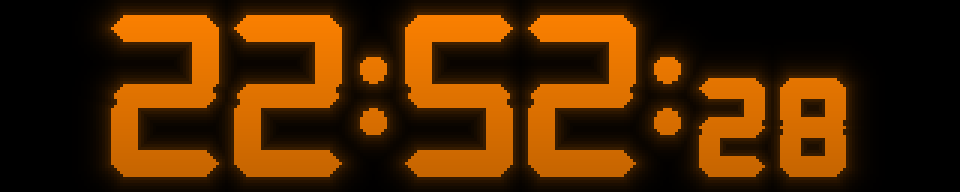

A clock whose digits melt into each other. Seven-segment glyphs are generated
rather than loaded from a font, and the morph interpolates their signed
distance fields and re-thresholds — so the outline moves and you get one solid
deforming figure, where a crossfade would give two superimposed glyphs at half
brightness. Time is read from the system clock inside the frame callback, so
the melt stays locked to the second rather than drifting with frame rate.

```console
$ python3 daliclock.py --12h --palette green --morph 0.6
```

### splitflap

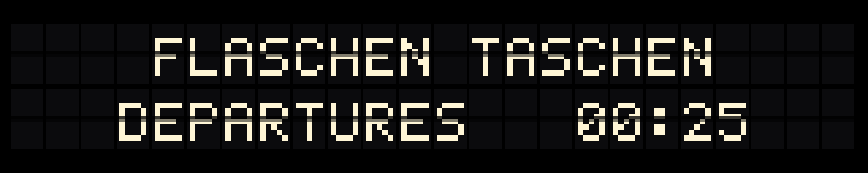

A split-flap departures board. Changing a letter riffles through *every*
intervening card in a fixed stack order, so blank→Z takes 26 flips and blank→B
takes two — that staggering, plus per-cell rate jitter and start delay, is what
makes the board ripple instead of switching in unison.

The flip is a real mechanism, not a crossfade: the outgoing glyph's top half
squashes toward the seam while the incoming glyph's top arrives above it, so
mid-flip a cell legitimately shows two different characters with a hard dark
seam between them. Past ninety degrees you see the card's back, which is the
incoming bottom half unfolding downward. Foreshortening is a nearest-neighbour
row resample rather than a blur, which at 64 rows would turn to mush.

Every squashed step of every card is baked at startup, so a frame is a handful
of small blits and settled cells are never touched — it is the cheapest demo
here by a wide margin. Glyphs are a 5x7 bitmap font in the source, no font file.

`{TIME}` and `{DATE}` are substituted live, so it can be a clock as well as a
sign.

```console
$ python3 splitflap.py --messages "SEQUOIA FABRICA|OPEN HOUSE {TIME};MAKE THINGS|ASK ANYONE" --hold 12
```

### scroller

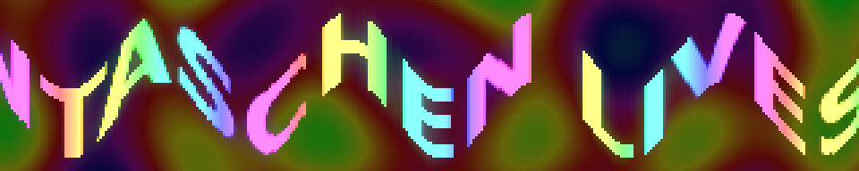

Rainbow glow text bouncing over a plasma field. The plasma is baked as a
seamless loop and replayed, and the text, its tint and its glow are baked once
into one wide strip, so each frame is a couple of slices. The bounce is
applied in *screen* space, not text space — a text-space wave travels with the
letters and just slides rigidly.

Expect a few seconds of black at startup while it bakes; `--plasma-frames`
trades loop length for startup time.

```console
$ python3 scroller.py --text "GREETZ  " --amp 16 --no-plasma
```

### headroom

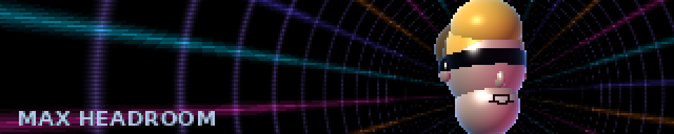

Max Headroom: a plasticky head in dark glasses stuttering in front of a
backdrop of neon stripes that rotates and recedes. The stutter is the
character, not a defect — holds, one-frame repeats, jumps back to an earlier
pose and the occasional freeze, all of them the artefacts of video that keeps
skipping, with a horizontal tear and an RGB split arriving on the glitch frames.

The room is one `np.take` from a table that packs the angle around the
vanishing point, 1/radius, the radial fade and the row parity into a single
index, so a frame is one gather rather than four trig evaluations over 20480
pixels. What that buys is also what it costs: the vanishing point cannot wander
continuously, because moving it means re-deriving `atan2` and `1/r` every
frame, so it cuts between three baked positions instead. On this material the
cuts read as deliberate camera jumps.

The head is a union of eight ellipsoids solved in closed form — the ray-ellipsoid
quadratic has an analytic nearest root, so there is no marching — baked into 20
yaw poses over about 100°, then blitted. Three of its features are painted as
bands in head space rather than built as geometry: the glasses, the hairline,
and the lit crest of the hair. That last one is what stops the hair reading as a
polished gold helmet — a single material shades smoothly however it is lit,
whereas splitting it into a lit front and an unlit swept-back mass gives the
silhouette a direction at 64 rows.

Getting it to read as plastic rather than as a mannequin took a pale, nearly
unpigmented base with the room's magenta arriving through the fill and a hard
specular carrying the surface; an earlier pass with the colour in the base
instead came out as meat.

The caption says MAX TAILSPACE, which is what a head and a room become when you
take the opposite of both halves — the sort of joke the character would have
made about himself, and it keeps the wall from claiming to be someone it is
not. `--say` takes anything; the stutter is derived from whatever it is given.

```console
$ python3 headroom.py --room acid --spin -1.5 --glitch 1
$ python3 headroom.py --say "" --side left --no-scanlines
$ python3 headroom.py --say BLIPVERT --room ice
```

### wopr


WOPR from *WarGames*: the lamp banks thinking on the left, the Falken exchange
printing itself out on the right. Two things made the 1983 prop memorable and
neither is a graphic — the monolith's rows of amber lamps blinking against each
other with a sweep occasionally crossing a bank, and chunky phosphor capitals
arriving one at a time.

The two speakers differ by colour *and* by rhythm, which is what lets you tell
who is talking from across the room without reading a word. WOPR prints
steadily with a few percent of jitter, because it is a computer; the human's
replies are paler, sit behind a `>` prompt, run at about half the speed, and
carry real hesitation — a wide spread per keystroke and an occasional quarter
second of nothing at a word boundary. A constant interval never reads as a
person.

The lamps are 112 numbers, not 4600 pixels: each gets a baked rate, phase and
duty, so its brightness is `((t*rate + phase) % 1) < duty`, and painting the
bank is a single gather through an index map with the glow already folded into
a weight map. The chase is a gaussian in lamp-column space, one per bank, with
incommensurate speeds so the banks never line up. Two things that did *not*
work: dimming the gaps between lamp rows for the grille, since those are
already black, and letting the chase push brightness past 1.0 — the store into
uint8 is unsafe, so a lamp at 1.2 wrapped round to dark green confetti.

The script is an argument, so anyone can retype it: `;` between lines, a
leading `>` for the human. The whole exchange lands in about 35 s and then
holds, so it finishes on FINE rather than being cut off mid-sentence.

```console
$ python3 wopr.py --layout lights --colour green
$ python3 wopr.py --script 'SHALL WE PLAY A GAME?;>LOVE TO.' --cps 14
```

### defcon


The big board from the same film, playing out an exchange: coastline in thin
glowing vector, missile tracks arcing over it, warheads blooming as expanding
rings, and a DEFCON readout stepping down while it all goes wrong. 320x64 is a
letterbox, and a letterbox is what a wall map wants to be.

**The map is real geography baked into the file** — Natural Earth 1:110m
coastline, public domain, simplified offline with Douglas-Peucker and encoded
as 81 polylines and 897 points in about 2 kB of source. Nothing is read at
runtime and nothing needs the network, which matters on a Pi that boots into
the rotation with no guarantee that anything else is reachable.

The projection is forced by the panel rather than chosen: 320 square pixels
across 360° of longitude is 1.125° a pixel, so 64 rows buy exactly 72° of
latitude. Taking that as 8°N–80°N turns out to be a gift rather than a
compromise, because that band *is* where the film's war happens — North
America, the Atlantic, Europe, Russia, China, Japan.

The map never moves, so it is rasterised once at 2x and box-filtered down; that
supersample is the whole reason the coast reads as a line rather than as a rash
of lit pixels, since a 1x Bresenham line on a 320-wide panel is either dashes
or, thickened, a blob. Per frame the demo composites into one float32
accumulator and maps it through a palette — about five whole-array passes and
no allocation. Each trajectory's pixel path is baked as a flat index array, so
a live track is six numpy calls over fifty-odd elements, and the spent tracks
that accumulate into the finale are drawn in eight pre-concatenated groups
rather than as ninety separate scatters.

It opens with tracks already in the air, because an effect that starts empty
spends its first seconds looking broken. From there the interval between
launches shrinks geometrically over the whole 80 s cycle — about one launch
every five seconds at the start, six to eight a second by the end — and flight
times shorten on the same curve, which compounds. DEFCON is derived from that
schedule rather than run off its own clock: the level drops as cumulative
launches cross fixed fractions of the total, so the countdown is a consequence
of the exchange instead of a caption over it.

Then it ends the way the film does. The impacts pile into a rising glare —
baked as one float per 1/60 s, an exponential pulse per detonation summed and
clipped, so it costs a scalar add — the board whites out, and everything goes
dark. After a beat of nothing, a block caret appears and types the line out a
character at a time:

> THE ONLY WINNING MOVE IS NOT TO PLAY

It reads as the machine at the other end composing it rather than as a caption
being switched on. The rhythm is a machine's — one interval wobbled five per
cent, because dead-constant timing at this size reads as a progress bar filling
and anything more uneven reads as a person at the keyboard, which is the wrong
character — with a beat where a terminal would return the carriage and a longer
one before the last word. The caret is solid while it writes and blinks only
once the line is finished; a caret that blinks *through* the typing looks like a
fault. The whole performance is capped at 55% of the phase and scales down
uniformly if it will not fit, so a long `--message` or a short `--cycle` types
faster rather than being cut off mid-word.

It is set in the same baked 3x5 pixel font as the readouts, scaled up and
wrapped to whatever fits, so there is no font file to be missing on the Pi. Then
the map fades back at DEFCON 5 and it starts again. The whiteout draws the board *under*
an additive white that dies as `(1-k)⁴`; a flat filled panel read as a fault
rather than as a detonation.

```console
$ python3 defcon.py --colour amber --arcs 10
$ python3 defcon.py --cycle 30 --speed 1.5      # hurry the war along
$ python3 defcon.py --message ""                # no epigram, longer war
```

### tron

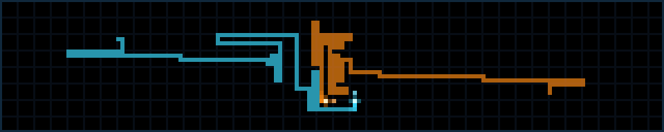

Light cycles, seen from above. Of everything in this directory this is the one
whose source material was already the right shape: the game grid in the film is
a wide rectangle viewed from overhead, which is what the wall is.

Two bikes leave solid ribbons behind them and turn only at right angles, on a
faint grid inside a lit border. The bike is hotter than its trail and carries a
lead spark, so the eye can find the live end of a line that is otherwise
uniform. When one is boxed in it **derezzes**: the panel flashes, the bike
bursts into blocks that scatter and fade over about 0.4 s, and then its ribbon
dissolves from the far end with a bright front running along it, like a fuse
burning backwards. Four rounds fit in the cycle.

The arena is a small integer array — at the default `--grid 2` it is 160x32
cells — scaled up with `np.repeat`, so a frame is a couple of array ops rather
than any drawing. Sim state is a pure function of the step index, which is what
keeps `render()` a pure function of `t`: a forward jump is just extra steps, and
a backward jump reseeds and replays. That matters because ftsched starts a demo
at t=0 having built it earlier, and the preview baker steps it at its own rate.

Two things worth saying plainly. **The riders rarely trap themselves.** On a
5120-cell board, two bikes with a 20-cell lookahead can dodge almost forever, so
most rounds end at a deadline where the steering comes off the rider with the
shortest way out and it is pointed at a wall. It is a real collision with a
visible obstacle, but the timing is scheduled rather than emergent. And **more
riders is not the fix on this hardware**: `--riders 3` and `--riders 4` are
genuinely better to watch, but they measure 44 and 40 ms a frame on a Pi 3
against the 33.3 that 30 fps allows, so they will not hold frame rate on the
wall. They are there for a faster host.

```console
$ python3 tron.py --riders 4 --colour neon      # better, but not on a Pi 3
$ python3 tron.py --grid 4 --speed 18           # chunkier, legible further away
$ python3 tron.py --rounds 2 --derez 2
```

### sneakers


SETEC ASTRONOMY, rearranging itself into TOO MANY SECRETS. Both are the same
fourteen letters — A C E E M N O O R S S T T Y — and the demo is that fact,
animated: every letter is a tile that lifts off the line, flies to its position
in the other phrase along a staggered arc, overshoots and settles.

A single line of large type is the best possible use of a 5:1 panel. Fourteen
glyphs across 320 px is 18 px of advance each, which at the default scale is
15 px of ink and 27 px tall — big enough to read from across a room, which is
the entire point. If both phrases are not legible the joke does not exist.

It opens the way the film's box does, with the letters churning through garbage
before they lock, and it holds each phrase long enough to actually be read. The
palette is amber phosphor with a scanline texture, deliberately unlike `wopr`
and `console`, which already own green.

**The anagram is checked at build time.** A supplied `--words` pair that is not
actually an anagram is refused with the difference spelled out, because the
failure mode otherwise is letters quietly appearing and vanishing mid-flight,
which looks like a rendering bug rather than a typo. The glyphs come from a 6x9
bitmap font in this file, baked at 16 brightness levels and two scanline
phases; a frame is a background copy and at most 28 tile blits, and there is no
font file to be missing on the Pi.

Honest about one thing: through the middle half-second of a crossing, fourteen
letters permuting inside a 64 px band do clump near the centre. In motion it
reads as objects crossing each other; a still frame makes it look worse than it
is. `--arc 1.5` buys more vertical separation if you want it.

```console
$ python3 sneakers.py --colour green --arc 1.5
$ python3 sneakers.py --words 'ELVIS|LIVES;DORMITORY|DIRTY ROOM'
$ python3 sneakers.py --hold 3 --speed 1.6       # impatient version
```

### trench


The Death Star trench, and the targeting computer that swings down over it.

Two walls, a floor and a strip of sky converging on a vanishing point, studded
with panel lines, hatches and lit greebles rushing past. The panel's shape does
the work: a 5:1 letterbox with the vanishing point centred puts the four
convergence lines in an X across the frame and leaves the near walls as big
slabs sweeping the outer thirds, which is what sells the speed.

Then the computer comes down — a dim amber bezel with hot orange reticle
brackets, the trench still visible through the middle — the two blips close on
the centre over about fifteen seconds, the lock verticals blink, and it swings
back up and out of frame. The run finishes without it, the torpedoes go in, and
the exhaust port blooms the whole panel white-amber before it all resets.

The geometry is a baked per-pixel inverse map, the rectangular cousin of what
`tunnel.py` does with a circle: `build()` resolves every pixel's ray against
four planes and stores one flat texture index plus a fog scalar, each surface is
written into the atlas twice back to back, and flying forward is `idx + off*W`
followed by a single `np.take`. Roll is thirteen baked angles picked per frame
and camera shake is a slice offset into padded maps, so neither costs anything.
Three passes over the frame in total.

It is deliberately dark. The far field falls off steeply because a gentler
curve left an aliased speckle cloud crawling around the vanishing point; the
price is that the middle third of the panel is nearly black for most of the run,
which on an LED wall reads as depth rather than as absence.

```console
$ python3 trench.py --no-computer --speed 1.4
$ python3 trench.py --greebles 2 --shake 1.5
$ python3 trench.py --cycle 30                  # one quick run
```

### fsn


"It's a UNIX system. I know this." The 3D file system navigator from Jurassic
Park — real software, SGI's `fsn` — as a flythrough over a dark plane of
extruded boxes.

Directories are gateways you fly *through*, with their path name above them and
ranks of small file blocks on plinths either side; walkways and a converging
ground grid tie the level together. The camera runs forward, banks, and passes
through one gateway after another, and the moment the pillars swell past the
edges of the panel with the next level visible through the opening is the best
thing in it. Labels are what make it say *filesystem* — the geometry alone reads
as structure but not as a directory tree, so `/HOME`, `/ETC`, `/PROC` and the
rest are doing real work rather than decorating.

The camera only translates, never rotates, so every box stays axis-aligned in
camera space and each visible face is a quad with straight screen-space edges;
bank is a shear folded into the projection. Boxes are pre-sorted by centre z and
tiled over three periods, so painter's order is a `bisect` slice with no
per-frame sort, and the ground, sky and clear are baked per bank angle so the
background is a memcpy.

**This one is where the Pi stopped being an abstraction.** It first measured
65 ms a frame there against 1.1 ms on a desktop, and the fix was not fewer
pixels but fewer numpy calls: on this hardware a numpy call inside real code
costs about 80 µs almost regardless of array size. Reducing the drawn content
was worth about 1.5 ms; restructuring was worth 30. Three traps, all worth
knowing before writing another of these:

- `np.clip` under numpy 1.19 costs **0.4 ms per call at any size** — a
  deprecation shim. Eight a frame is 3 ms of nothing.
- A **`float32` scalar** costs 50 µs per arithmetic operation against 1.6 µs
  for a plain Python float. All scalar maths here is `math`, not numpy.
- `int_array + 0.5` silently promotes to float64, so a scanline pass written
  the obvious way runs in double precision.

Even so it lands around 45 ms p95 on the wall's Pi rather than the 20 that was
wanted, so it runs at 20 fps in the rotation rather than 30. It is a slow camera
move over a mostly static landscape and it does not miss the extra frames;
dropping them unpredictably would have looked worse than not asking for them.

Worth knowing when reading any of these numbers: betelgeuse currently reports
`throttled=0x50005` with its ARM clock pinned at 600 MHz instead of 1200, which
is under-voltage, not heat. Every timing here was taken in that state, so they
are all roughly a factor of two pessimistic against a Pi 3 on a healthy supply.

```console
$ python3 fsn.py --caption --density 1.2
$ python3 fsn.py --depth 6 --speed 1.5
$ python3 fsn.py --no-labels --no-grid       # just the landscape
```

### esper


The Esper machine from Blade Runner: a photograph, enhanced to death. Deckard
talks to a screen — ENHANCE 224 176, PAN RIGHT, STOP, TRACK 45 LEFT — and the
machine walks a reticle over a still and dives into it, until a detail that was
never visible in the original fills the frame.

That sequence is almost the only thing in cinema built for a 5:1 letterbox. The
picture is a wide still, the commands run along the bottom in one thin line, and
the whole drama is a crop rectangle moving. **The blockiness is the aesthetic
rather than a compromise** — every move lands frankly pixelated and resolves in
three visible steps, 8x8 blocks to 4x4 to 2x2 to full detail, which is what the
film's enhancements do and what a 320 px panel does anyway.

**The photograph is generated, not baked.** `build()` draws a 1280x256 room in
numpy: deep shadow, a sodium lamp, venetian blind bars across the left wall, a
doorway with a figure in it, a chair, and a mirror on the far wall reflecting a
workbench. It is detailed at several scales on purpose, because a source with
detail at only one scale gives you one good zoom and then nothing — the
wallpaper stripes are 8 px, the chair slats 3 px.

On that bench is a soldering iron, 48 px end to end with a tip two pixels
across, and it is the payoff. At the opening framing the whole bench is a smudge
and the tip is a single warm pixel indistinguishable from a highlight on the
glass; at the last enhance the tip is the brightest thing on the panel and the
thing it is attached to is unmistakable. The cord trailing off the handle and
the tapered hot tip are what carry the read. The V-cradle it rests in is at the
edge of what survives at this size — what comes across is that the iron is
propped in *something*, which is enough; a coiled-wire holder was tried first
and read as nothing at all, because at five pixels a turn a helix is not a
shape.

A zoom is one gather. The source and its three mosaic levels are stored flat as
(N, 3) uint8, and a frame computes 320 column and 64 row indices from the
current crop and does a single `np.take`. No resampling, no PIL, no float in the
per-frame path. Scanlines are free: the source is stored twice, once dimmed, and
odd rows index the second copy.

Eight moves, about 60 s, so it wants a `seconds: 70` slot — a cut before the
mirror is a cycle with no ending in it.

```console
$ python3 esper.py --colour amber               # monochrome Esper CRT
$ python3 esper.py --cycle 40 --speed 1.2       # the short version
$ python3 esper.py --no-commands                # just the photograph moving
```

### voxel

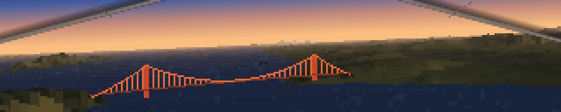

A hang glider's tour of San Francisco Bay: in off the Pacific, through the
Golden Gate *between the towers*, across the front of the city with Alcatraz
opening to port, north up the bay past Treasure Island and the Bay Bridge,
round Angel Island, back west over Sausalito and up over Hawk Hill with
Tamalpais on the horizon, then out past Point Bonita to the open sea and round.
Comanche-style voxel space: for every screen column, march a ray out along the
ground, look up the height under it, and work out how far up the screen that
lands. The nearest thing wins. It is the oldest trick for drawing landscape in
real time and it is still the right one here, because the cost is set by the
number of columns and the depth budget rather than by any amount of geometry.

**The terrain is real, and it is in the file.** 768x768 cells of USGS 3DEP
elevation at 45.8 x 57.6 m a cell, covering 37.635–38.035 N and 122.28–122.68 W
— Mount Tamalpais in the north-west, the Marin Headlands over the strait, the
Golden Gate, San Francisco out to Twin Peaks and San Bruno Mountain, Angel
Island, Alcatraz, Yerba Buena, the Berkeley hills. 3DEP is public domain;
`scripts/make-voxel-dem.py` is the one-off bake that downloads it, fills the
voids where the survey stops at the continental shelf, works out which of it is
water and writes `voxel-dem.npz`, and the provenance is written down at the top
of that script. The demo itself reads only the committed asset and needs
nothing but numpy — no network, no GDAL. It comes to 201 kB because the heights
are quantised to whole metres and stored as the horizontal *difference*:
terrain is smooth, so the differences are small numbers around zero and DEFLATE
eats them, four or five times better than it manages on the raw heights. Sea
level is stored as exactly zero, so the Bay and the Pacific are a comparison
rather than a second map.

**The map was labelled with the wrong box, and nothing looked wrong.** The bake
asked the National Map's ImageServer for 0.4° of longitude by 0.31° of latitude
as a square image. That service will not letterbox: when the bbox aspect and
the image aspect disagree it silently widens the bbox until they match and
returns *that*, with nothing in the response to say so. So the grid held 0.4° of
latitude — 44 km of California — while the file said 34, and everything scaled
from that header was wrong in proportion to how far it sat from the middle of
the map. Alcatraz was 200 m out and looked fine. Mount Tamalpais was three
kilometres south of where it is. The Bay Bridge got built a kilometre clear of
Yerba Buena Island, in open water, which is the sort of thing you only catch by
knowing where the bridge is meant to touch down. It is fixed in the header and
in the script, and `fetch()` now refuses a bbox whose aspect does not match the
image it is asking for, because that is the only check that would have caught
it.

**The depth march never loops over depth.** The obvious implementation walks
the ray one step at a time per column, and that is a few thousand numpy calls a
frame; on a Pi 3 a numpy call costs about 80 µs whatever size the array is, so
it is over budget before it has drawn anything. Instead the whole (steps ×
columns) grid of sample heights is built in one go and the painter's ordering
falls out of a running minimum: down the depth axis the projected row of the
highest-thing-so-far only ever decreases, so *the number of steps whose ceiling
is still below a screen row is exactly the index of the first step that covers
it*. That count, for every row at once, is a histogram of the ceilings followed
by a cumulative sum — `np.bincount` and `np.cumsum` — and it is the whole
reason the effect fits in a frame.

**Everything on screen is one integer.** The palette is a flat table laid out
as `(class × shade) × haze band`, so a pixel's colour is one gather at the very
end and nothing in the frame computes RGB. Distance haze is free, because the
depth step chooses a band and the band is already the right colour. The chop
and the sun's glitter on the water are an integer *add* on the pixels that are
water — a brighter shade is `+NFOG` — and they pick up the correct haze for
their distance without knowing anything about it. A bridge is a class like any
other, so painting it is writing class numbers into that index image before the
gather.

**The bridges have to be objects.** A heightmap cannot have sky under a road
deck. Each column's ray is intersected with the vertical plane of the deck, a
2x2 solve vectorised across the whole width, which gives that column's position
along the span and its distance from the eye together; and since the raycast
has already left a depth per pixel, hiding it behind Lime Point is one compare.
There are two of them, and that is why the geometry is a table rather than
code: a name, a latitude, a bearing, a list of span lengths in feet and three
colours, from which the same compositor draws either. The Golden Gate is the
real thing in the units `goldengate` uses — 4200 ft of main span, 526 ft of
tower over a deck 220 ft above the water — with the detail that carries the
silhouette, the main cable's vertex sitting *on* the deck at midspan. The Bay
Bridge is the western crossing, 2310 ft of main span either side of the central
anchorage, in silver-grey steel rather than International Orange; at the three
to eleven kilometres the tour sees it from, what survives is a pale line low on
the haze with two nubs on it where the towers are, and the temptation to scale
it up is the temptation to draw something that is not there. Its eastern span
is left out because Yerba Buena Island is in front of it.

**The Gate transit is the shot the route is built around.** The flight crosses
the plane of the bridge 267 m from midspan — the main span runs 640 m either
side of that — at 161 m above the water, which is between the deck at 67 m and
the tower tops at 227 m. So it genuinely passes between the towers and under
the cables, and for two seconds the deck is overhead and the suspenders are
sliding past on both sides. Everything else about the waypoints was arranged
around making that happen on the right heading.

**Sutro Tower is there and it is five pixels.** 298 m of tower on a 255 m
ridge, which makes it the only part of San Francisco legible from across the
bay, so it is drawn: sunset.py's sprite unchanged, three prongs on a lattice
body stepping out to a splayed tripod base, scaled by nearest neighbour into a
table of silhouettes at every whole pixel height and depth-tested as a
billboard against the raycast, so Twin Peaks in front of it hides it. The
downtown skyline was tried and left out — from six kilometres it is four rows of
very slightly lighter grey against a hazy hill, which is to say it is nothing.
The one thing worth knowing about the size table is why its lower bound is
where it is: the tower crosses the threshold *during* a pass, and set one pixel
higher — at the size where it still reads as a trident — it dropped out for a
single frame on the way past. A landmark slightly too small beats one that
blinks.

**The route is a Fourier series, and that is not a flourish.** A closed flight
path has to be three things at once. Exactly periodic, so a segment that
overruns the loop lands back where it started rather than drifting off the map
— measured at 2 × 10⁻¹⁰ m of drift after thirty-seven loops. Smooth to the
second derivative, because that is what the bank is built out of. And uniform in
arc length, because otherwise the glider surges and stalls between waypoints, a
lurch this file has already been fixed for once. A harmonic series is the first
two for free, and its derivatives are closed-form rather than divided
differences. An interpolating spline would have passed exactly through the
waypoints and put a discontinuity in that second derivative at every one of
them — eleven places a loop where the wing snaps from one bank to another.

Two things it took two attempts to get right. The corners are rounded by
rolling the coefficients off with a *Gaussian* rather than by cutting them off
at the last one: a rectangular window rings, and since curvature carries a
factor of k² a ripple far too small to see in the flight path is a wobble you
cannot miss in the horizon. And the arc-length parameterisation is a separate
pass that does *not* re-smooth — evaluate the curve densely, resample it at even
spacing along itself, refit, twelve times. Smoothing again on every pass is a
heat flow, and a heat flow shrinks a closed curve: it took a 26 km tour down to
7 km, which looked entirely plausible until somebody measured it. Done properly
the ground speed varies by 2.3% over the whole loop.

**Height goes with what is beside you, and the instinct was backwards.**
Parallax is the only thing that says you are moving, and it goes as one over the
distance to what you pass, so the obvious move is to fly as low as possible.
That was tried at 130–200 m the whole way round and it is wrong twice over.
First, an eye at 150 m over a bay 10 km wide puts every far shore inside two
pixels of the horizon: the picture becomes a flat line with water under it and
there is nothing to have parallax *against*. Second, and this is the one that
is easy to miss, a 320x64 panel at this focal length has a **25 degree vertical
field** — so anything closer than about four and a half times your height is
below the bottom of the frame. Alcatraz was routed past at 200 m, and at 800 m
abeam it was not subtle, it was *invisible*. So the Gate is flown at 145 m
between deck and tower tops, the open crossings at 235–265 where you look down
on the bay and Alcatraz, Angel Island and the Berkeley hills are separately
visible instead of stacked on one line, Hawk Hill at 350 with 80 m of air over
it, and the landmarks are passed at one to two kilometres rather than at three
hundred metres.

**A hang glider cannot tour the bay in three minutes.** The circuit is 28.9 km
and the loop is 210 seconds, which is 138 m/s — 496 km/h, about eleven times
what a wing actually does. A real one at 13 m/s would need thirty-seven
minutes. That is a deliberate trade and it is the right one: the alternative is
either a tour nobody watches to the end, or a demo that circles one thermal and
reads as rotation rather than travel, which is what this was before. Flying
lower makes a given speed read faster, so a good part of the apparent motion is
bought with height rather than with speed; and `--loop` is one flag away if you
want it slower.

**The wing is off by default, and that is a change of mind.** In a coordinated
turn the pilot and the wing keep the same relationship and it is the world that
tilts, so the two spars can be a static overlay costing one composite while the
horizon rolls behind them — a cheap way to frame the shot, and `--wing` still
does it. But they were drawn for a demo that circled one point. The tour changes
heading far more often, and against a picture whose whole subject is the
landscape going past, two fixed diagonals across the sky stop reading as
structure overhead and start reading as scaffolding over the view. The frame is
better without them.

The bank is independent of that, and is scaled well down from
true: at this speed the turns really are banked most of the way over, and on a
panel five times wider than it is tall the horizon rises about five pixels per
degree of roll and leaves through the corner before you reach ten.

**The bank was a square wave once, and the flight path was the reason.** The
bank comes from the curvature of the path, and the path used to carry a wobble
at three times the circuit rate; curvature comes out of the second derivative,
where a harmonic at k times the fundamental picks up a factor of k², so at nine
times the weight the wobble contributed more curvature than the circle it
decorated. The signal arriving at the roll clamp was forty to sixty times the
clamp, 99% of the loop sat pinned hard over at one limit or the other, and the
horizon flipped between them in a couple of frames. It was not a display
problem. The glider was genuinely lurching, and no smoothing applied after the
clamp could have helped.

The gain onto the roll was measured rather than guessed, at the value that puts
the 95th percentile of the turn rate on the limiter's knee, and the limiter is
`limit · tanh(x/limit)` rather than a clamp, because a clamp has a corner in it
and a corner in the roll is the horizon stopping dead. On the tour the same
gain gives a roll running −5.6° to +2.6°, changing at a median of 0.19°/s and
never faster than 1.3°/s, with the soft limiter engaged for 6% of the loop —
against 0.13 to 0.71°/s on the old thermal circuit, which is the price of
actually turning corners instead of circling, and still nothing like a snap.
A real wing has roll inertia and takes about a second to roll in, so the bank is
read off the curve a second behind where the glider is. Doing that with an
integrator would have put state in `render()`, which has to stay a pure function
of `t` or the demo cannot be seeked; evaluating the same closed curve at
`t − lag` is the same thing analytically, shifts every harmonic by its own share
of the delay, and stays exactly periodic.

Two things that only showed up by looking at frames. The sky ramp is indexed in
*thirds* of a row rather than whole ones — with whole rows, the sheared horizon
steps the index by one somewhere along the width and draws a vertical seam
straight down a gradient this smooth. And the haze colour is deliberately
darker and greyer than the sky above it: matched to the sky, which is the honest
thing for thick haze, the skyline stops existing and the whole picture collapses
into one diagonal gradient.

The far plane is 17 km rather than 13, which is what it takes to have Mount
Tamalpais on the horizon at all — from the Sausalito leg it is 13.4 km off, and
at 784 m it is the highest thing in the model. That costs about 0.04 ms a frame,
because the depth schedule is geometric and stretching it only makes the steps
slightly coarser rather than adding any. On this desktop the whole frame is
0.51 ms mean and 0.69 ms at the 95th percentile at `--steps 96`.

**The Pi 3 is the only number that matters, and betelgeuse is running at half
its clock.** `vcgencmd get_throttled` reports `0x50005` — under-voltage, not
heat — and the ARM clock sits at 600 MHz against a rated 1200 whatever the
governor believes. Everything below is at 600 MHz, on the system numpy 1.19.5,
as CPU time over a whole 210-second loop. Restoring the power supply roughly
halves all of it.

| | p50 | p95 | fits, at 40% headroom |
|---|---|---|---|
| first version of this file | 63 ms | 78 ms | 7 fps |
| after the first optimisation pass, `--steps 96` | 47 ms | 61 ms | 9 fps |
| after the second, `--steps 96` | 45 ms | 56 ms | 10 fps |
| **the default now** (`--steps 64`) | **39 ms** | **51 ms** | **11 fps** |
| `--coarse` | 30 ms | 42 ms | 14 fps |

Three things the desktop hid, and one that the first pass got wrong.

`--steps` is **not** the cost knob it looks like — 96 to 32 saves only a
quarter of the frame, because half the work is per output *pixel* and does not
care how many depth samples there were. It is now 64 by default, which is the
setting where the difference from 96 is a slight coarsening of the nearest
hillsides and nothing else; 48 and below is visibly blocky in the foreground
and is not worth having.

**The 95th percentile is one shot.** Not the average frame at all: for the ten
seconds either side of the Gate transit the bridge is the whole width and most
of the height of the panel, and it was costing 25 ms of a 65 ms frame while
the rest of the loop paid 5. Almost all of that was the compositor's fault
rather than the bridge's. `np.putmask` cannot write through a non-contiguous
array — it silently copies, puts, and copies back — so painting four parts
into a sub-rectangle of the frame was eight copies of that rectangle, and the
box is now gathered into a contiguous scratch once. And the mask that decides
which rows each part covers was asking `row >= top` of *floats*, which on this
machine is four times what the same question costs of shorts; a row is inside
a part exactly when it is at or below `ceil(top)`, so that is what it asks.

**The dtype is the lever, and int16 is a real one.** A float32 pass is 21 ns an
element here and an int32 pass is 5, so it pays to cast early rather than
late; and the two running scans — the painter's-order minimum down the depth
axis and the prefix sum over the histogram — cannot be vectorised down the
axis they run along, which makes them the frame's longest serial stretches and
the most sensitive to width. `np.minimum.accumulate` over the depth grid is
1.37 ms in float32, 1.88 in int32 and **0.64 in int16**. Everything that is a
screen row, a bin number or a step index is a short now, and the ceiling, the
clamp and the narrowing all happen *before* the scan rather than after, which
is free to do because every one of them is monotonic and so commutes with a
running minimum.

**`--coarse` marches the landscape at half width and doubles it back**, which
is nearly two thirds of the frame halved and is what gets the demo to 15 fps.
The bridges, Sutro Tower, the birds, the sun and the palette are still drawn at
full width afterwards, so what coarsens is the terrain and nothing that has an
edge you were looking at: side by side the shoreline and the hillsides step in
twos and the water's glitter is chunkier, and the Golden Gate is pixel for
pixel the same. It is off by default because it is a visible change and the
default should be the honest picture.

**And the numpy the wall runs on is worth as much as the inner loop.** 1.19.5
is what Raspberry Pi OS ships and it is from 2020. Measured beside it in a
throwaway `pip install --target` — the system numpy untouched, because
`ftsched` runs against it — the *unmodified* file was 17% quicker under 2.0.2
(52→43 ms median, 65→53 at the 95th) and only 6% quicker under 1.26.4, so it
is 2.x's rebuilt ufunc loops doing it rather than the cheaper
`__array_function__` dispatch that 1.26 also has. Against the file as it is
now, which has less dispatch left to save, 2.0.2 is 6 to 8%: 35 ms median and
45 at the 95th by default, and 26 and 37 with `--coarse`, which is 16 fps. It
is a free win for every demo in the rotation and not only this one — and the
only reason it has not been taken here is that changing the numpy the wall
runs against is not a decision to make as a side effect of tuning one demo.
2.0.2 is the last release that supports the Pi's Python 3.9.

```console
$ python3 voxel.py --light dusk --fog 1.4
$ python3 voxel.py --loop 420 --altitude -60    # half speed, and lower
$ python3 voxel.py --bank 1.6 --roll-lag 0      # steeper, and no roll inertia
$ python3 voxel.py --coarse                     # half-width landscape, 15 fps
$ python3 voxel.py --no-wing --no-tower --birds 0 --steps 96
$ python3 scripts/make-voxel-dem.py     # re-bake the terrain (needs Pillow)
```

## demoscene.py

The shared part. Each demo parses the usual options, precomputes what it can,
then hands a `render(t, frame) -> (H, W, 3)` callback to a fixed-rate loop
that pushes frames with `send_array_banded()`.

```python
import demoscene as ds

ap = ds.parser("Bouncing dot")
ap.add_argument("--radius", type=float, default=6.0)
args = ap.parse_args()

def render(t, frame):
    ...

ds.run(render, args)
```

It also carries the colour helpers, which matter more than they look. An
effect that computes one scalar per pixel and maps it through a palette is
both far cheaper than computing RGB directly and much easier to make look
good, since the palette carries the art. `gradient()` builds a lookup table
from colour stops, `rainbow()` sweeps hue, and `fire`, `ice`, `toxic` and
`magma` ship ready to use.

## Writing one that looks right on a wide panel

These effects are usually written for something squarer and taller than a
320x64 wall, and most of them need adjusting for it. Things that caught us:

- Anything with a **rate per row** — fire's cooling, for one — is tuned for a
  screen two or three times taller. Over 64 rows it never finishes, and you
  get a solid sheet of colour.
- **Shading on radius** needs scaling against the display, and on a panel this
  wide almost every pixel counts as near, so the effect flattens out. Shade on
  something in the effect's own units instead, like depth.
- A **tiled texture** must be genuinely seamless or rotation will show hard
  diagonal seams. Sine terms need whole numbers of cycles across the texture,
  and a radial term cannot tile at all.
- **Single-pixel elements** carry no weight. A near star drawn the same size
  as a far one makes a starfield read as static rather than as motion.

The frame-interval trace in [`../tools/ft-emulator`](../tools/ft-emulator) is useful
here: a stall shows up as a spike there long before it moves the average, and
stalls rather than average jitter are what read as visible flicker.

## Older Python demos

`fsa.py`, `grid.py`, `ripple.py` and `sierpinski_rain.py` predate the shared
module and use `flaschen_np.py`, a local numpy client, setting pixels
individually rather than pushing frames.
